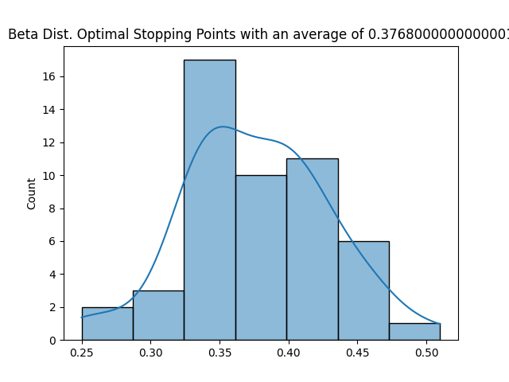
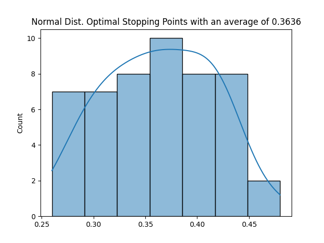
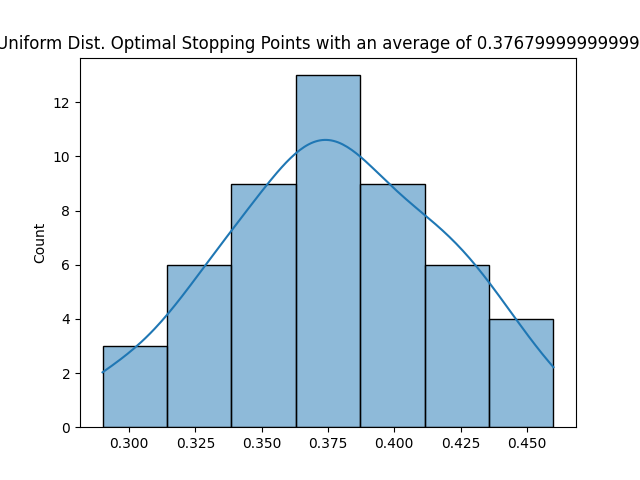
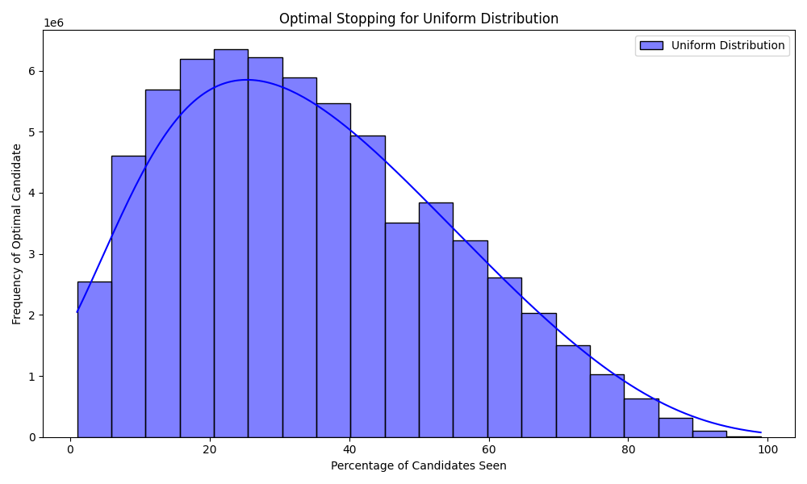
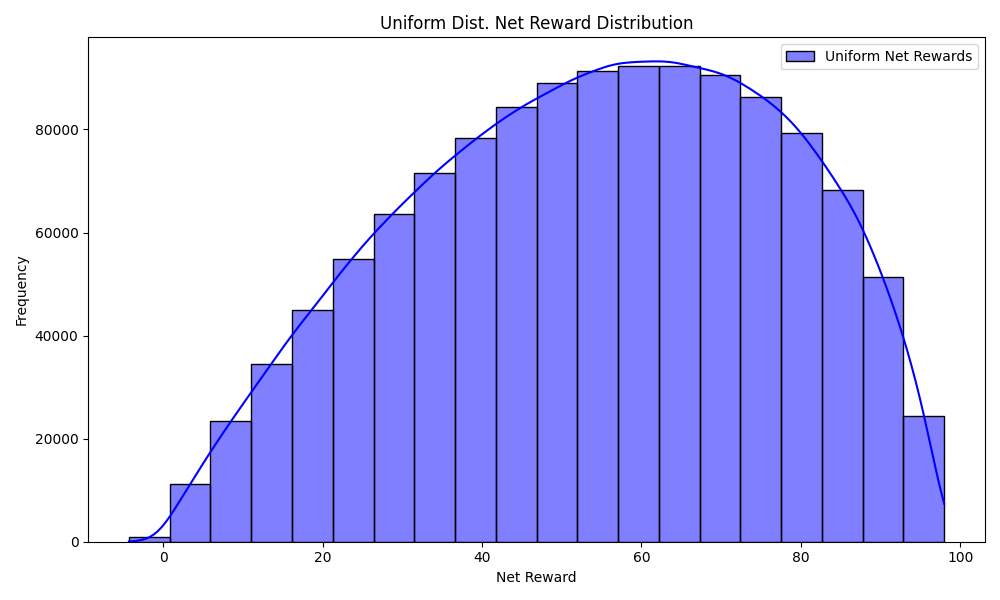
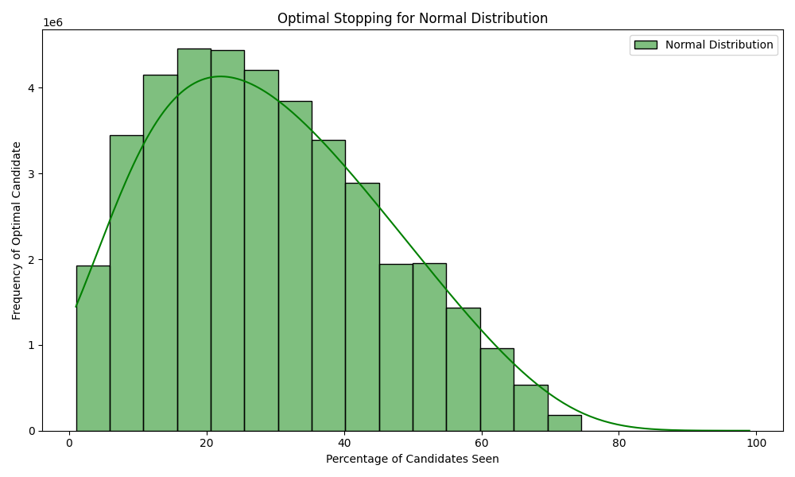
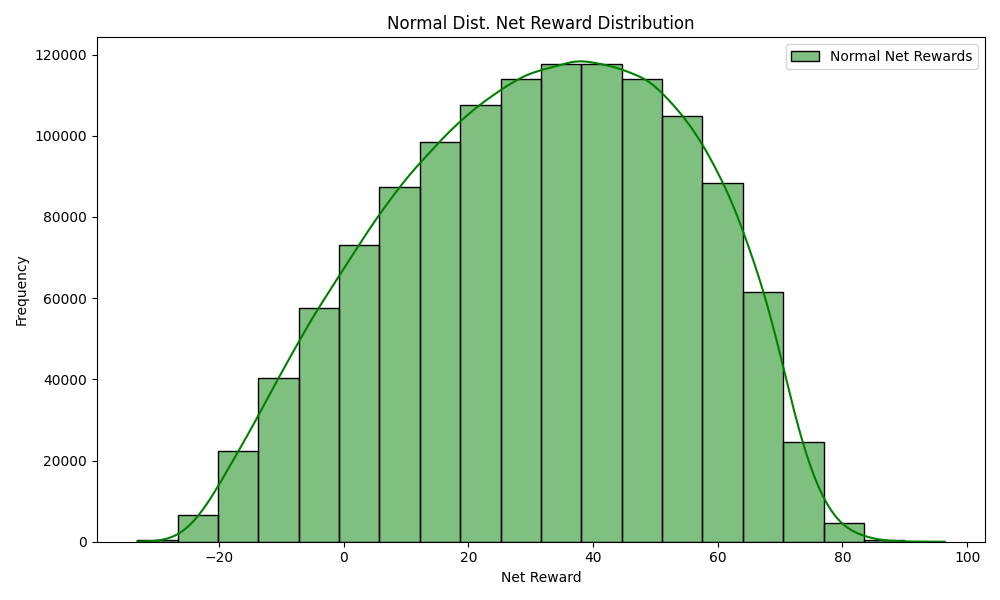

# Optimal Stopping

## Team Members:
* Kaden Hart
* Logan Liddiard
* Joel Pierson
* Ben Tomlinson

## Project Overview

This project focuses on applying the Optimal Stopping Problem across different scenarios. There were three main parts:
1. Determining the General Optimum
2. Exploring Alternative Distributions
3. Maximizing Benefit in Investment Decisions

## Requirements:

* Python 3.x
* Required packages: `numpy`, `scipy`, `matplotlib`, `seaborn`
These can be installed by running:
```
pip install numpy scipy matplotlib seaborn
```

## How to run:

The main python file for submission is `HW1_Lastname_Firstname.py` which accepts an argument to control the size of the test (`small` or `large`).

* `small` runs a quick version of the tests with only two iterations.
* `large` runs a longer version of the tests with 50 iterations.

### For example:
```
python HW1_Lastname_Firstname.py small
```
or
```
python HW1_Lastname_Firstname.py large
```

The program wilil execute the algorithm on various distributions and generate results based on the selected mode. For **large** mode, it will also generate graphs comparing the results for different strategies and save them as PNG files in the current directory.

## Analysis of the Results:

### Part 1: General Optimum

    Upon testing this algorithm rigorously, we have determined that the optimal stopping point is closer to 37% for this optimal stopping problem. This coorelates to the readings and discussions to what we had in class. 

### Part 2: Alternative Distributions

    Interestingly enough after running about 50,000 experiments and taking the best outcome of each 1000, we graphed a distribution plot for each of the distributions they were all close to 37% with slight variances for each. The following is the results of these three serparate runs of these experiments:

        - Beta Dist. 37.68%
        - Normal Dist. 36.36%
        - Uniform Dist. 37.68%

    To save the the hastle of rerunning our larger experiment the graphs for each are provided and labeled below as so:

<p align="center">
  
</p>
<p align="center">
  
</p>
<p align="center">
  
</p>


### Part 3: Investment Strategy

    When doing the Investment Strategy, we ran 50,000 experiments on both uniform and and normal distributions. The optimal threshold for uniform distributions was 34.33%, and the optimal threshold for the normal distributions was 27.37%. This showed significantly different values compared to our past parts. Also, we found that the average net reward was far higher for the normal distributions than the uniform distributions.

    Below are some of our graph data collected for the optimal stopping threshold and net rewards gained.

**Uniform**:
<p align="center">
  
</p>
Net rewards:
<p align="center">
  
</p>
**Normal**:
<p align="center">
  
</p>
Net Rewards:
<p align="center">
  
</p>

## Conclusion

Throughout this project, we explored various applications of the **Optimal Stop Problem**, experimenting with different distributions and decision-making strategies to identify when to stop and make the best possible selection.

We learned that the classic 37% rule is quite reliable, being able to hold across different distributions. However, it is important to always be aware of the task at hand and to not always assume that the 37% rule is applicable in every real-world instance, as can be seen with the Investment Strategy problem, where the optimal threshold was 34.33% and 27.37% for the uniform and normal distributions respectively.

Overall, we've learned that the 37% rule is very reliable, however, its important to always understand the problem you are trying to solve and to test other methods if it is not providing a desirable result. Often, real-world applications do not reliably reflect theoretical distributions so its always important to understand different factors of the problem such as the distribution of data or sunken-cost aspects of many real-life applications.